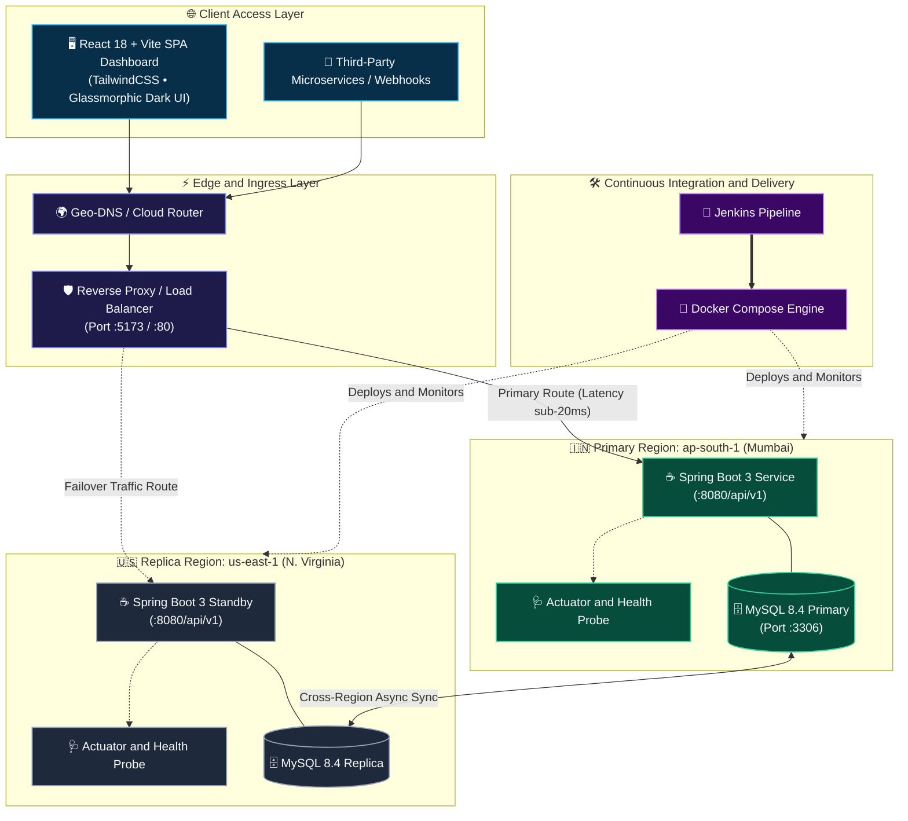
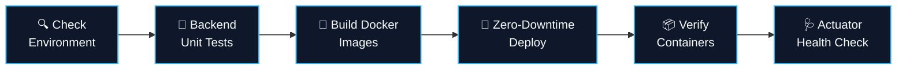

<!-- ========================================================================= -->
<!-- HEADER & ANIMATED BANNER                                                 -->
<!-- ========================================================================= -->
<div align="center">

<a href="https://github.com/bangalsubham20/multi-region-task-manager">
  
</a>

<br/>
<br/>

[](https://github.com/bangalsubham20/multi-region-task-manager)
[](https://www.oracle.com/java/)
[](https://spring.io/projects/spring-boot)
[](https://react.dev/)
[](https://www.typescriptlang.org/)
[](https://www.mysql.com/)
[](https://www.docker.com/)
[](https://www.jenkins.io/)
[](LICENSE)

<br/>

<p align="center">
  <b>Enterprise-Grade • Multi-Zone Distributed Orchestration • Instant Regional Failover • Low Latency Geo-Routing</b>
</p>

<p align="center">
  <a href="#-quick-start">🚀 Quick Start</a> •
  <a href="#-system-architecture">🏛️ Architecture</a> •
  <a href="#-api-reference">📡 API Docs</a> •
  <a href="#-live-telemetry--regions">🌍 Regional Telemetry</a> •
  <a href="#-cicd-pipeline">🔄 CI/CD</a> •
  <a href="#-contributing">🤝 Contributing</a>
</p>


</div>

---

<!-- ========================================================================= -->
<!-- LIVE REGIONAL CLUSTERS                                                   -->
<!-- ========================================================================= -->
## 🌍 Live Regional Telemetry & Status

<div align="center">
  
</div>

---

<!-- ========================================================================= -->
<!-- PROJECT SHOWCASE                                                         -->
<!-- ========================================================================= -->
## 🖥️ Platform Showcase

<div align="center">
  
  <p align="center"><i>Interactive telemetry dashboard displaying real-time task queues, replication health, and geographic workload distribution.</i></p>
</div>

---

<!-- ========================================================================= -->
<!-- KEY HIGHLIGHTS                                                           -->
<!-- ========================================================================= -->
## ✨ Key Capabilities

<table>
  <tr>
    <td width="50%">
      <h3>🌐 Multi-Region Geo-Routing</h3>
      <p>Dynamic request dispatching routes task schedules to the optimal geographic availability zone (e.g. <code>ap-south-1</code>, <code>us-east-1</code>, <code>eu-central-1</code>) to ensure sub-50ms execution latency.</p>
    </td>
    <td width="50%">
      <h3>🔄 Active-Active Replication</h3>
      <p>Continuous asynchronous state synchronization across regional persistence tiers ensures cross-region consistency without blocking worker threads.</p>
    </td>
  </tr>
  <tr>
    <td width="50%">
      <h3>🛡️ Autonomous Regional Failover</h3>
      <p>Integrated Spring Boot Actuator health checks continuously assess node readiness. Traffic automatically reroutes to standby replicas when a regional outage is detected.</p>
    </td>
    <td width="50%">
      <h3>⚡ High-Performance Reactive UI</h3>
      <p>React + Vite front-end delivering sub-second updates, responsive filter engines, dark-mode glassmorphic aesthetics, and live metrics visualization.</p>
    </td>
  </tr>
  <tr>
    <td width="50%">
      <h3>📊 Distributed Metrics &amp; Tracing</h3>
      <p>Out-of-the-box telemetry endpoints (<code>/api/v1/system/metrics</code>, <code>/api/v1/system/info</code>) track JVM uptime, task volume by priority, and cluster health.</p>
    </td>
    <td width="50%">
      <h3>🚀 Fully Automated CI/CD</h3>
      <p>Turnkey declarative <code>Jenkinsfile</code> orchestrates Maven compilation, unit/integration test suites, multi-stage Docker builds, and zero-downtime deployment.</p>
    </td>
  </tr>
</table>

---

<!-- ========================================================================= -->
<!-- ARCHITECTURE                                                             -->
<!-- ========================================================================= -->
## 🏛️ System Architecture



---

<!-- ========================================================================= -->
<!-- TECH STACK                                                               -->
<!-- ========================================================================= -->
## 🛠️ Tech Stack & Ecosystem

| Component | Technology | Version | Description |
|:---|:---|:---|:---|
| **Backend Core** | Java + Spring Boot | `21` / `3.2.3` | High-throughput reactive REST API &amp; business engine |
| **ORM / Persistence** | Spring Data JPA (Hibernate) | `6.x` | Clean repository abstraction with dynamic querying |
| **Database** | MySQL | `8.4 LTS` | Relational storage for tasks, states, and regional metadata |
| **Frontend Framework** | React + TypeScript | `18+` / `5.x` | Modular single-page dashboard with strict typing |
| **Build Tools** | Vite + Maven Wrapper | `5.x` / `3.9.x` | Blazing-fast HMR frontend + reproducible backend builds |
| **API Documentation** | Springdoc OpenAPI (Swagger UI) | `2.5.0` | Interactive live API testbed at `/api/v1/swagger-ui.html` |
| **Containerization** | Docker &amp; Docker Compose | `v2+` | Fully reproducible multi-container orchestration |
| **CI/CD Automation** | Jenkins Pipeline | `Declarative` | Automated environment checks, tests, builds &amp; deployments |

---

<!-- ========================================================================= -->
<!-- DIRECTORY STRUCTURE                                                      -->
<!-- ========================================================================= -->
## 📁 Repository Structure

```tree
multi-region-task-manager/
├── 📂 backend/                     # Spring Boot 3 Enterprise Microservice
│   ├── 📂 src/main/java/com/multiregion/taskmanager/
│   │   ├── 📂 config/              # OpenAPI, CORS & Security configurations
│   │   ├── 📂 controller/          # REST Endpoints (TaskController, SystemController)
│   │   ├── 📂 dto/                 # Request/Response Data Transfer Objects
│   │   ├── 📂 entity/              # JPA Database Models (Task, Priority, Status)
│   │   ├── 📂 repository/          # Spring Data JPA repositories with query methods
│   │   └── 📂 service/             # Task workflow & regional routing logic
│   ├── 📂 src/main/resources/      # Multi-environment configs (dev, prod, docker)
│   ├── 📄 Dockerfile               # Multi-stage Java 21 build container
│   └── 📄 pom.xml                  # Maven dependencies & build definitions
│
├── 📂 frontend/                    # Modern React 18 + TypeScript + Vite Dashboard
│   ├── 📂 src/
│   │   ├── 📂 components/          # Reusable UI widgets, Modal, StatsCards, Navbar
│   │   ├── 📂 hooks/               # Custom hooks (useTasks, useSystemStatus)
│   │   ├── 📂 pages/               # DashboardPage, TaskListPage, TaskDetailPage
│   │   └── 📂 services/            # Axios API clients with error handling
│   ├── 📄 Dockerfile               # Production Nginx container
│   └── 📄 vite.config.ts           # Bundler configuration
│
├── 📂 docs/                        # Technical Documentation & Assets
│   └── 📂 assets/                  # High-res graphics & animated SVG telemetry
│
├── 📄 docker-compose.yml           # Unified multi-service local cluster definition
├── 📄 Jenkinsfile                  # Complete 6-stage CI/CD automated pipeline
└── 📄 README.md                    # Project documentation
```

---

<!-- ========================================================================= -->
<!-- GETTING STARTED                                                          -->
<!-- ========================================================================= -->
## 🚀 Quick Start

### ⚙️ Prerequisites
Make sure you have the following installed on your machine:
- [Docker & Docker Compose](https://www.docker.com/) (Recommended)
- [Java Development Kit (JDK 21)](https://adoptium.net/) (For manual backend execution)
- [Node.js (v18+) & npm](https://nodejs.org/) (For manual frontend execution)
- [Git](https://git-scm.com/)

---

### 🐳 Option A: 1-Click Launch with Docker Compose (Recommended)

1. **Clone the repository:**
   ```bash
   git clone https://github.com/bangalsubham20/multi-region-task-manager.git
   cd multi-region-task-manager
   ```

2. **Spin up the entire cluster (MySQL 8.4 + Backend + Frontend):**
   ```bash
   docker compose up --build -d
   ```

3. **Check container status:**
   ```bash
   docker compose ps
   ```

4. **Access the application:**
   - 💻 **Frontend Web App:** [http://localhost:5173](http://localhost:5173)
   - ⚡ **Backend API Root:** [http://localhost:8080/api/v1](http://localhost:8080/api/v1)
   - 📖 **Interactive Swagger UI:** [http://localhost:8080/api/v1/swagger-ui/index.html](http://localhost:8080/api/v1/swagger-ui/index.html)
   - 🩺 **Actuator Health Monitor:** [http://localhost:8080/api/v1/actuator/health](http://localhost:8080/api/v1/actuator/health)

---

### 💻 Option B: Manual Local Development

<details>
<summary><b>Click to expand step-by-step local instructions</b></summary>

<br/>

#### 1. Start MySQL Database
Ensure MySQL is running on `localhost:3306` with database `task_manager`:
```sql
CREATE DATABASE IF NOT EXISTS task_manager;
```

#### 2. Run the Spring Boot Backend
```bash
cd backend
# Windows:
.\mvnw.cmd spring-boot:run

# Linux / macOS:
./mvnw spring-boot:run
```
The backend initializes on port `8080` under context path `/api/v1`.

#### 3. Run the React Frontend
```bash
cd frontend
npm install
npm run dev
```
The Vite development server will start at `http://localhost:5173`.

</details>

---

<!-- ========================================================================= -->
<!-- API REFERENCE                                                            -->
<!-- ========================================================================= -->
## 📡 REST API Reference

The backend provides a comprehensive, documented REST API under the `/api/v1` context path:

### 📋 Task Management Endpoints

| Method | Endpoint | Description | Sample Query / Body |
|:---:|:---|:---|:---|
| `GET` | `/api/v1/tasks/search` | Paginated search, sorting &amp; filtering | `?page=0&size=10&status=IN_PROGRESS` |
| `GET` | `/api/v1/tasks/{id}` | Retrieve specific task by ID | `Path: id = 1` |
| `POST` | `/api/v1/tasks` | Create a new task in active region | `{"title":"Deploy Cluster","priority":"HIGH"}` |
| `PUT` | `/api/v1/tasks/{id}` | Update existing task details | `{"status":"COMPLETED"}` |
| `DELETE` | `/api/v1/tasks/{id}` | Remove task from regional catalog | `Path: id = 1` |

### 🩺 System & Observability Endpoints

| Method | Endpoint | Description | Response Type |
|:---:|:---|:---|:---|
| `GET` | `/api/v1/system/info` | Dynamic JVM, active region &amp; uptime stats | `SystemInfoResponse` |
| `GET` | `/api/v1/system/metrics` | Aggregate task counts by priority &amp; status | `TaskMetricsResponse` |
| `GET` | `/api/v1/actuator/health` | Container and database liveness probes | `UP / DOWN` |

<details>
<summary><b>🔍 Sample Request &amp; Response (JSON)</b></summary>

<br/>

**POST `/api/v1/tasks` Request Body:**
```json
{
  "title": "Synchronize Frankfurt Node",
  "description": "Trigger automated cross-region database replication health check.",
  "status": "TODO",
  "priority": "HIGH",
  "dueDate": "2026-10-05"
}
```

**Response (201 Created):**
```json
{
  "success": true,
  "message": "Task created successfully",
  "data": {
    "id": 142,
    "title": "Synchronize Frankfurt Node",
    "description": "Trigger automated cross-region database replication health check.",
    "status": "TODO",
    "priority": "HIGH",
    "dueDate": "2026-10-05",
    "createdAt": "2026-09-30T00:45:10",
    "updatedAt": "2026-09-30T00:45:10"
  }
}
```

</details>

---

<!-- ========================================================================= -->
<!-- CI/CD PIPELINE                                                           -->
<!-- ========================================================================= -->
## 🔄 Automated CI/CD Pipeline

The project includes an enterprise-grade automated pipeline defined in [`Jenkinsfile`](Jenkinsfile):



1. **Check Environment**: Verifies installed tools (`java`, `git`, `node`, `docker`, `docker compose`).
2. **Run Backend Tests**: Runs `./mvnw test` to validate business logic and repository queries.
3. **Build Docker Images**: Executes multi-stage container compilation with image layer caching.
4. **Deploy Application**: Initiates `docker compose up -d` in detached background mode.
5. **Check Containers**: Inspects running services via `docker compose ps`.
6. **Health Check Probe**: Loops with automatic retries against `http://localhost:8080/api/v1/actuator/health` to confirm healthy startup.

---

<!-- ========================================================================= -->
<!-- CONFIGURATION                                                            -->
<!-- ========================================================================= -->
## ⚙️ Environment Variables

| Variable | Default Value | Description |
|:---|:---|:---|
| `SERVER_PORT` | `8080` | Spring Boot backend HTTP listener port |
| `AWS_REGION` | `ap-south-1` | Active geographic deployment zone identifier |
| `APP_ENV` | `development` | Runtime environment profile (`development`, `docker`, `production`) |
| `DB_URL` | `jdbc:mysql://localhost:3306/task_manager` | JDBC database connection string |
| `DB_USERNAME` | `root` | Database authentication username |
| `DB_PASSWORD` | `root` | Database authentication password |

---

<!-- ========================================================================= -->
<!-- CONTRIBUTING & LICENSE                                                   -->
<!-- ========================================================================= -->
## 🤝 Contributing

Contributions make the open-source community an inspiring place to learn and innovate. Any contributions you make are **greatly appreciated**!

1. **Fork the Project**
2. **Create your Feature Branch**:
   ```bash
   git checkout -b feature/dynamic-failover
   ```
3. **Commit your Changes**:
   ```bash
   git commit -m 'feat: add automated failover circuit breaker'
   ```
4. **Push to the Branch**:
   ```bash
   git push origin feature/dynamic-failover
   ```
5. **Open a Pull Request**

---

## 📄 License

Distributed under the **MIT License**. See [`LICENSE`](LICENSE) for complete legal details.

<div align="center">


<br/>

**Built with ❤️ for High-Availability Distributed Systems by [bangalsubham20](https://github.com/bangalsubham20)**

<p align="center">
  <a href="#multi-region-task-manager">⬆️ Back to Top</a>
</p>

</div>
